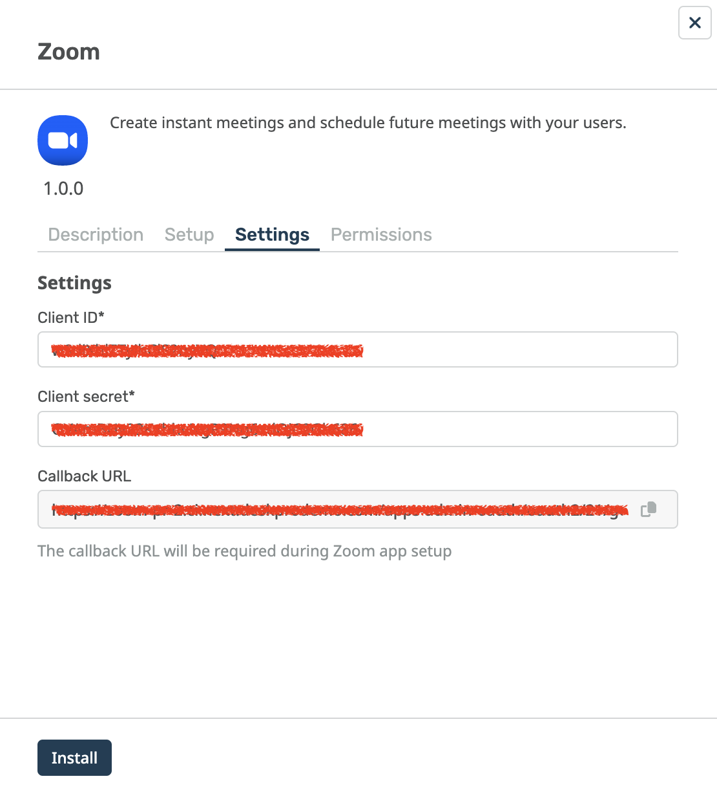

Zoom App Setup Instructions
===

To install the Zoom app, you must first create an app with a "Client ID" and "Secret ID".

Head over to [Zoom marketplace](https://marketplace.zoom.us/user/build) and navigate to the "Develop" section (under your user profile menu, top right of the screen) and click "Build App"

And __create__ an "OAuth" application

Enter the following details for your new Application:

1. App Name - "Deskpro App" (or any name you prefer)
2. Choose app type - "Account-level app"
3. Don't publish to Marketplace

Then click "Create"

Step by step, we need to configure the application:

On the __App credentials page__ we'll need the Client ID and Client secret of our Zoom app. __Keep these safe.__

There are two fields "Redirect URL for OAuth" and "Add allow lists" that we need to fill in. You can copy these from the Zoom settings on the Settings tab. These two fields have the same values.

On the __Basic information page__ fill in the fields

* Short description
* Long description
* Developer contact name
* Developer contact email

We can skip the __Add Feature page__.

On the __Add Scopes page__ we need to select the following scopes:

* Meeting
  * View all user meetings (*meeting:read:admin*)
  * View and manage all user meetings (*meeting:write:admin*)
* User
  * View all user information (*user:read:admin*)

Ok, head back to Deskpro and enter your Client ID and Client secret into the app settings form.

Click on the "Permissions" tab and select the users/groups that you'd like to have access to the GitLab app.

When you're happy - click __Install__.
