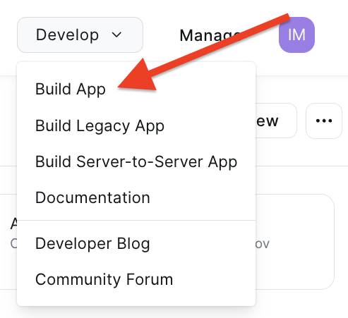

Zoom App Setup Instructions
===

To install the Zoom app, you must first create an app with a "Client ID" and "Client Secret".

Head over to [Zoom marketplace](https://marketplace.zoom.us/user/build) and navigate to the "Develop" section (under your user profile menu, top right of the screen) and click "Build App"

Next, we are required to complete the necessary fields.

To change the name, you need to click on the pencil icon. And give the name "Deskpro App" (or any name you prefer).

and provide the following information for your new Application:

1. Choose the __"Development"__ tab;
2. Section __"Select how the app is managed"__: choose __"Admin-managed"__;
3. Section __"App Credentials"__: save __"Client ID"__ and __"Client Secret"__, we will need them later;
4. Copy the __Сallback URL__ on the "Settings" tab and paste it into the "OAuth Redirect URL" and "OAuth Allow Lists". These two fields have the same values.

then click __"Continue"__ several times to navigate to the menu __"Features"__ -> __"Surface"__ and in the section __"Select where to use your app"__ choose __"Meetings"__

then also click __"Continue"__ a  couple time to navigate to __"Scopes"__.

and here we need to __"+ Add"__ the following scopes:

* Meeting
  * View all user meetings (*meeting:read:admin*)
  * View and manage all user meetings (*meeting:write:admin*)
* User
  * View all user information (*user:read:admin*)

Ok, head back to Deskpro and enter your __Client ID__ and __Client secret__ into the app settings form.

Click on the "Permissions" tab and select the users/groups that you'd like to have access to the Zoom app.

When you're happy - click __Install__.
